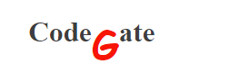

<a name="readme-top"></a>

<!--
HOW TO USE:
This is an example of how you may give instructions on setting up your project locally.

Modify this file to match your project and remove sections that don't apply.

REQUIRED SECTIONS:
- Table of Contents
- About the Project
  - Built With
  - Live Demo
- Getting Started
- Authors
- Future Features
- Contributing
- Show your support
- Acknowledgements
- License

OPTIONAL SECTIONS:
- FAQ

After you're finished please remove all the comments and instructions!
-->

<div align="center">
  <!-- You are encouraged to replace this logo with your own! Otherwise you can also remove it. -->
  
  <br/>

  <h3><b>CodeGate</b></h3>

</div>

<!-- TABLE OF CONTENTS -->

# 📗 Table of Contents

- [📖 About the Project](#about-project)
  - [🛠 Built With](#built-with)
    - [Tech Stack](#tech-stack)
    - [Key Features](#key-features)
  - [🚀 Live Demo](#live-demo)
- [💻 Getting Started](#getting-started)
  - [Setup](#setup)
  - [Prerequisites](#prerequisites)
  - [Install](#install)
  - [Usage](#usage)
- [👥 Authors](#authors)
- [🔭 Future Features](#future-features)
- [🤝 Contributing](#contributing)
- [⭐️ Show your support](#support)
- [🙏 Acknowledgements](#acknowledgements)
- [📝 License](#license)

<!-- PROJECT DESCRIPTION -->

# 📖 [CodeGate] <a name="about-project"></a>

**[CodeGate]** is a project developed in capstone project module 1 in microverse where is related with software development company where we developer software by using different technologies

## 🛠 Built With <a name="built-with"></a>

### Tech Stack <a name="tech-stack"></a>


<details>
  <summary>Client</summary>
  <ul>
    <li><a href="https://html.org/">HTML</a></li>
    <li><a href="https://javascript.org/">Javascript</a></li>
    <li><a href="https://css.org/">CSS</a></li>
  </ul>
</details>

<!-- Features -->

### Key Features <a name="key-features"></a>


- **[Responsive in all device ]**
- **[Improved user experience]**
- **[Dynamic data]**

<p align="right">(<a href="#readme-top">back to top</a>)</p>

<!-- LIVE DEMO -->

## 🚀 Live Demo <a name="live-demo"></a>

- [Live Demo Link](https://byiringiroscar.github.io/capstone_microverse_one/)

<p align="right">(<a href="#readme-top">back to top</a>)</p>

<!-- GETTING STARTED -->

## 💻 Getting Started <a name="getting-started"></a>

To get a local copy up and running, follow these steps.

### Prerequisites

In order to run this project you need:
<ul>
    <li><a href="https://code.visualstudio.com/">vscode</a></li>
    <li><a href="#!">liveserver extension</a></li>
    <li><a href="#!">blowser</a></li>
  </ul>

<!--
Example command:

```sh
 gem install rails
```
 -->

### Setup

Clone this repository to your desired folder:
https://github.com/byiringiroscar/capstone_microverse_one

<!--
Example commands:

```sh
  cd my-folder
  git clone git@github.com:myaccount/my-project.git
```
--->

### Install


Install this project with: cd capstone_microverse_one
<!--
Example command:

```sh
  cd my-project
  gem install
```
--->

### Usage


To run the project, execute the following command: run index.html

<!--
Example command:

```sh
  rails server
```
--->
<p align="right">(<a href="#readme-top">back to top</a>)</p>

<!-- AUTHORS -->

## 👥 Authors <a name="authors"></a>

> Mention all of the collaborators of this project.

👤 **Author1**

- GitHub: [@githuboscar](https://github.com/byiringiroscar)
- LinkedIn: [LinkedIn](https://www.linkedin.com/in/oscar-byiringiro-9baa8313a/)

<p align="right">(<a href="#readme-top">back to top</a>)</p>

<!-- FUTURE FEATURES -->

## 🔭 Future Features <a name="future-features"></a>


- [ ] **[Create many slide]**
- [ ] **[Add more animation]**
- [ ] **[Add contact form]**

<p align="right">(<a href="#readme-top">back to top</a>)</p>

<!-- CONTRIBUTING -->

## 🤝 Contributing <a name="contributing"></a>

Contributions, issues, and feature requests are welcome!

Feel free to check the [issues page](../../issues/).

<p align="right">(<a href="#readme-top">back to top</a>)</p>

<!-- SUPPORT -->

## ⭐️ Show your support <a name="support"></a>

If you like this project you can buy me cofee here [link](https://www.linkedin.com/in/oscar-byiringiro-9baa8313a/)

<p align="right">(<a href="#readme-top">back to top</a>)</p>

<!-- ACKNOWLEDGEMENTS -->

## 🙏 Acknowledgments <a name="acknowledgements"></a>

- **I would like to thank microverse for make this thing happen**
- **I would like to take my coding partner**

<p align="right">(<a href="#readme-top">back to top</a>)</p>


<!-- LICENSE -->

## 📝 License <a name="license"></a>

This project is [MIT](./MIT.md) licensed.


<p align="right">(<a href="#readme-top">back to top</a>)</p>
